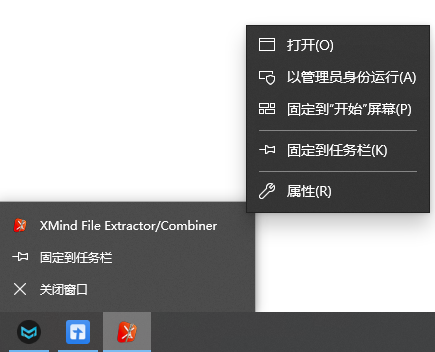
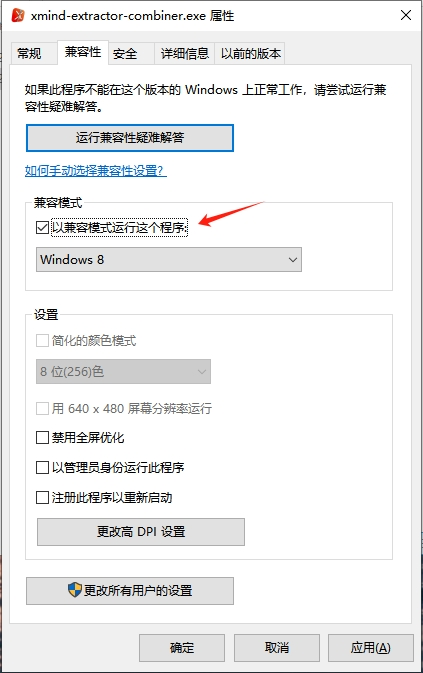

# XMind File Extract/Combine

This project is an exercise to learn how to use Tauri, React and Typescript in Vite.

In fact XMind file is a simple zip file and you can use any zip tool to extract or restore (combine) it.

## Start from Tauri template project

### Prerequirements

Follow the [official documentation](https://tauri.app/zh-cn/v1/guides/getting-started/prerequisites)

### Start and Test

First, we need to install the dependencies:

```bash
npm install
```

Then, we can start the development server and test the app:

```bash
npm run tauri dev
```

This will start the Tauri dev server and open the app.

#### Windows 10

I met blank window when running the app on Windows 10. Here are the steps to fix them:

- launch the app by calling `npm run tauri dev`
- right click on the app icon in the taskbar and then right click on the app icon in the popup menu, click "Properties"
- select "Compatibility" tab and check "Run this program in compatibility mode"
- re-launch the app






### Build for Production

To build the app for production, run:

```bash
npm run build
```

## Developing the purpos of this project

- [Developing](./docs/Developing.md)

